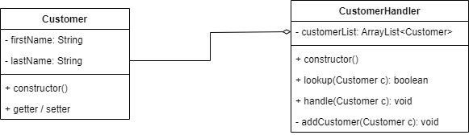

Bài toán:

Thực hiện nhiệm vụ tìm kiếm khách hàng trong 1 list. Nếu không tìm thấy khách hàng thì thêm khách hàng vào List.

Quan hệ kết tập phải thỏa mãn:
- Lớp tổng thể phải chứa đối tượng của các lớp con
- Trong phương thức khởi tạo của lớp tổng thể phải khởi tạo đối tượng của lớp con

